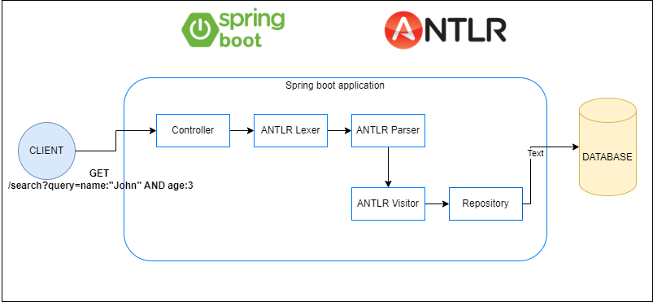
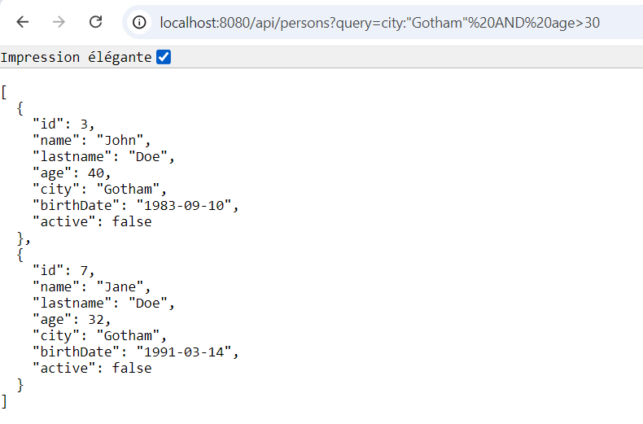
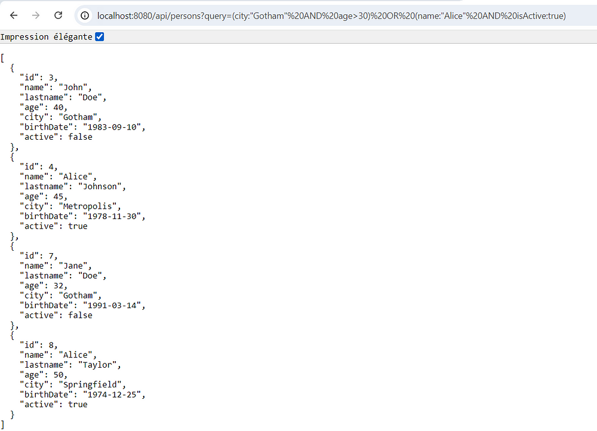

# Spring Boot and ANTLR Example

## Introduction

### Spring Boot
Spring Boot is a framework that simplifies the setup and development of Spring applications. It provides a variety of features to help build production-ready applications quickly, including embedded servers, auto-configuration, and production-ready metrics.

### ANTLR
ANTLR (ANother Tool for Language Recognition) is a powerful parser generator for reading, processing, executing, or translating structured text or binary files. It generates parsers, lexers, and tree walkers from grammar files, making it ideal for building custom languages or data formats.

This project demonstrates how to integrate Spring Boot with ANTLR to create a RESTful service that uses custom query languages.



## Project Setup

### 1. Docker Setup

To run the PostgreSQL database using Docker, follow these steps:

1. **Install Docker**: Ensure you have Docker installed on your machine. You can download it from [Docker's official website](https://www.docker.com/products/docker-desktop).

2. **Run Docker Compose**:
   Navigate to the project root directory where the `docker-compose.yml` file is located.

   ```
   docker-compose up -d
   ```

   This command starts the PostgreSQL container in detached mode.

### 2. Running the Spring Boot Application

1. **Build and Run**:
   Ensure you have Maven installed. You can build and run the Spring Boot application with:

   ```
   mvn clean install
   mvn spring-boot:run
   ```

   This will start the Spring Boot application and create the PostgreSQL database schema using Liquibase.

2. **Database Initialization**:
   The `insert_data.sql` file is used to populate the `person` table with initial data. It will be executed automatically by the Spring Boot application as part of the database initialization process.

### 3. Testing Requests

You can test the application by sending HTTP requests to the REST API endpoints.

- **Base URL**: http://localhost:8080/api/persons

  **Examples:**
    - **Simple Query**: Find all persons in "Gotham" with age greater than 30
      ```
      curl "http://localhost:8080/api/persons?query=city:"Gotham" AND age>30"
      ```

        

    - **Complex Query**: Find all persons who are either in "Gotham" and over 30 years old or have the name "Alice" and are active. This query demonstrates the use of logical operators and grouping.
      ```
      curl "http://localhost:8080/api/persons?query=(city:"Gotham" AND age>30) OR (name:"Alice" AND active:true)"
      ```

      

## Project Structure

The project structure is as follows:

```
spring-boot-antlr-example\
├── docker-compose.yml
├── src\
│   ├── main\
│   │   ├── antlr4\
│   │   │   └── SimpleQuery.g4
│   │   ├── java\
│   │   │   └── spring\
│   │   │       └── antlr\
│   │   │           └── tutorial\
│   │   │               ├── controller\
│   │   │               ├── exception\
│   │   │               ├── model\
│   │   │               ├── repository\
│   │   │               └── service\
│   │   ├── resources\
│   │       ├── application.yml
│   │       └── db\
│   │           └── changelog\
│   │               └── changes\
│   │                   ├── add-table-person.yml
│   │                   ├── db.changelog-master.yaml
│   │                   └── init-schema.yml
├── src\
│   └── test\
│       ├── java\
│       │   └── spring\
│       │       └── antlr\
│       │           └── tutorial\
│       │               └── PersonControllerTest.java
│       └── resources\
│           ├── application-test.yml
│           └── insert_data.sql
```

Feel free to adjust the file paths and names according to your specific project setup.

---

This `README.md` provides a comprehensive overview of the project, setup instructions, and testing guidelines. Let me know if you need any further adjustments!
